# ⚙️ CI/CD + DevSecOps

This project uses **GitHub Actions workflows** for application and infrastructure automation, along with **DevSecOps tools** for code quality and security scanning.  
It provides **end-to-end traceability** of application and infrastructure changes, with gates for **security, quality, and compliance**.

---

## 🔄 Workflows

### 1. **App Build**
The application build workflow ensures that every code change is verified for quality and security **before deployment**.

**Steps in sequence:**
1. **SonarQube Scans** → frontend, backend, worker  
2. **Trivy FS Scans** → filesystem vulnerabilities in frontend, backend, worker  
3. **Trivy Config Scans** → IaC/config validation for frontend, backend, worker  
4. **Build Docker Images** → frontend, backend, worker  
5. **Trivy Image Scans** → security scan on built images  
6. **Push Images to Registry**  
7. **Trigger App Deployment** (only if all previous checks succeed)  

---

#### ✅ Positive Scenario
When all checks pass, the pipeline successfully builds, scans, and pushes Docker images.

📸 **Screenshot: App Build (Positive Case)**  
This shows the pipeline flow when all SonarQube and Trivy scans pass, followed by a successful Docker build and push.  
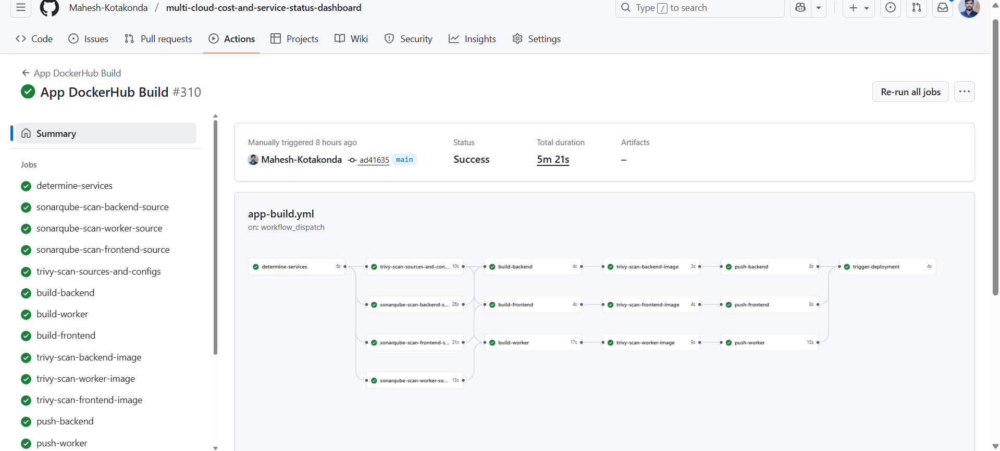

---

#### ❌ Negative Scenario
If one or more checks fail, the pipeline stops and deployment is blocked.  

📸 **Screenshot: App Build (Negative Case)**  
Here, the worker container fails SonarQube scan, and a later Trivy image scan fails for one image. The pipeline blocks publishing images, preventing deployment.  
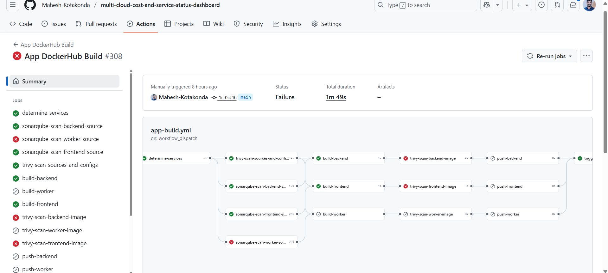

---

### 2. **App Deploy**
This workflow deploys containers onto **EC2 instances** using deployment strategies.  

- **Frontend & Backend** → Blue-Green deployment (zero downtime).  
- **Worker** → Rolling deployment strategy.  

📸 **Screenshot: App Deploy Workflow**  
This screenshot shows the App Deploy pipeline in GitHub Actions, where containers are deployed using Blue-Green and Rolling strategies.  
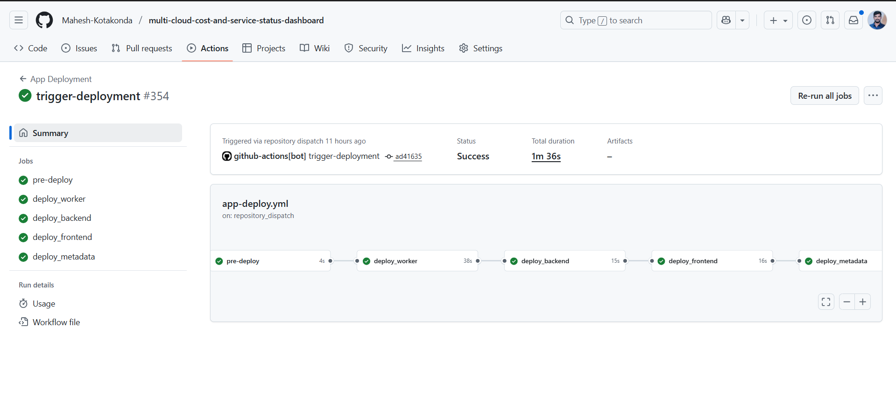

---

### 3. **App Rollback**
This workflow restores the last stable deployment if a release fails.  

- Reads **JSON configs from S3** to identify the last stable version.  
- Removes failing containers and restores the previous image/config.  

📸 **Screenshot: App Rollback Workflow**  
This screenshot shows a rollback workflow execution, restoring services to the last stable state using stored configurations.  
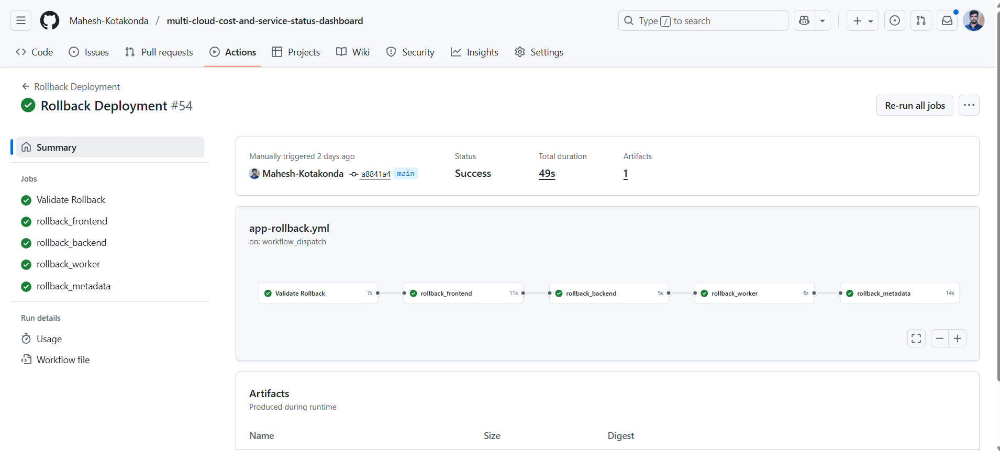

---

### 4. **Infra Creation**
This workflow provisions infrastructure securely with **Terraform** and validates it before applying.

**Steps in sequence:**
1. **SonarQube Scan** → static code analysis of Terraform project  
2. **Trivy FS Scan** → filesystem scan for Terraform modules  
3. **Trivy Config Scan** → IaC misconfiguration scan  
4. **Terraform Apply** → provisions VPC, subnets, ALB, EC2, RDS  

---

#### ✅ Positive Scenario
📸 **Screenshot: Infra Creation (Positive Case)**  
This screenshot shows the Terraform workflow passing SonarQube, FS, and Config scans successfully, then applying infrastructure resources.  
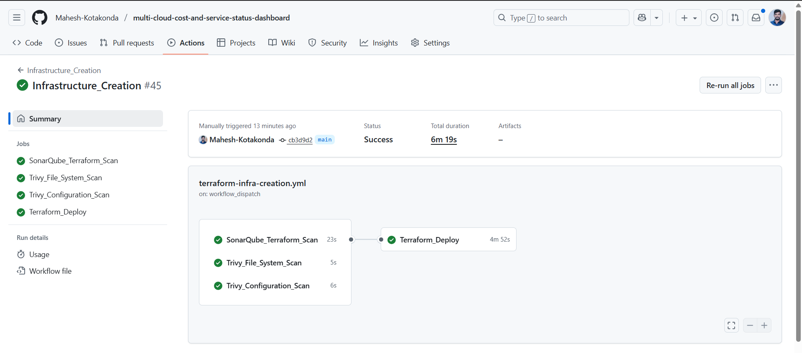

---

#### ❌ Negative Scenario
📸 **Screenshot: Infra Creation (Negative Case)**  
Here, the Terraform project fails SonarQube analysis, or Trivy finds IaC misconfigurations, which blocks Terraform Apply.  
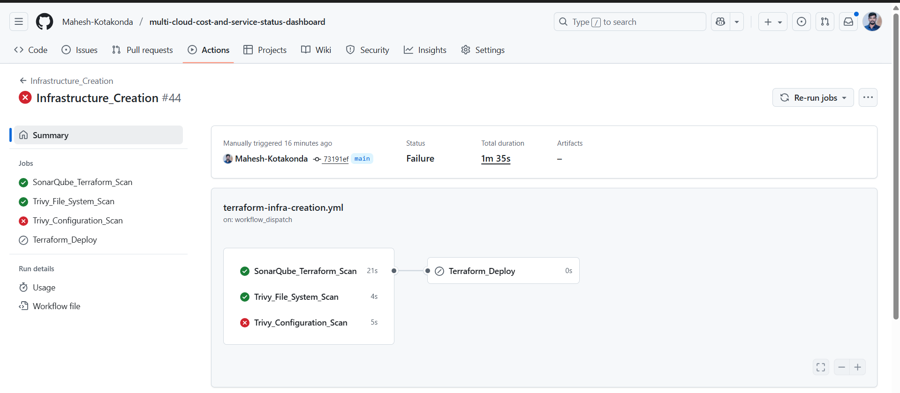

---

### 5. **Infra Destroy**
This workflow safely tears down all resources created by Terraform.  

📸 **Screenshot: Infra Destroy Workflow**  
This screenshot shows the pipeline execution for tearing down Terraform-managed infrastructure.  
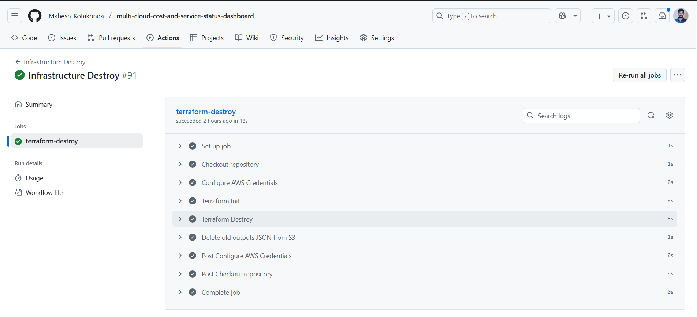

---

## 🛡️ DevSecOps Integration

### 🔹 SonarQube
SonarQube is integrated into both **App Build** and **Infra Creation** workflows:  
- **Application Code** → Python (backend, worker) + ReactJS (frontend)  
- **Infrastructure Code** → Terraform  

It detects:  
- Bugs  
- Vulnerabilities  
- Code smells  
- Maintainability issues  
- IaC misconfigurations  

---

### 🔹 Trivy
Trivy provides multiple security scans:  
- **FS Scans** → filesystem-level vulnerabilities in application projects and Terraform code  
- **Config Scans** → detect misconfigurations in application config files and IaC modules  
- **Image Scans** → scan built Docker images for CVEs before pushing  

These checks ensure **end-to-end application + infrastructure security**.  

---

## 📸 Scan Results

### 🔹 SonarQube Portal Overview
📸 **Screenshot: SonarQube Project List**  
This view shows all four projects tracked in the SonarQube portal. Each project is scanned independently for quality gates.  
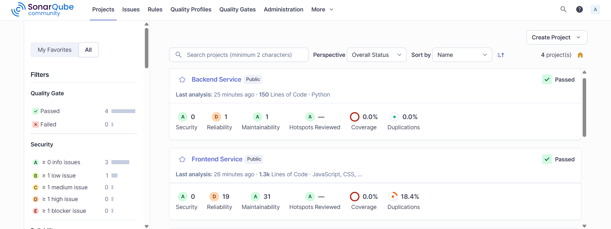  
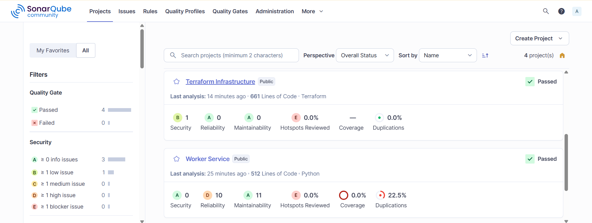

---

### 🔹 SonarQube Project Dashboards
Each project has its own dashboard for deeper insights into code quality.  

- **Frontend Project**  
  📸 This dashboard shows bugs, vulnerabilities, and code smells in the ReactJS frontend project.  
  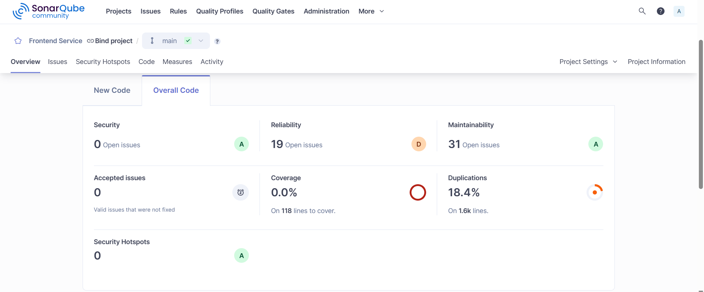  

- **Backend Project**  
  📸 This dashboard shows quality analysis of the Python backend services.  
  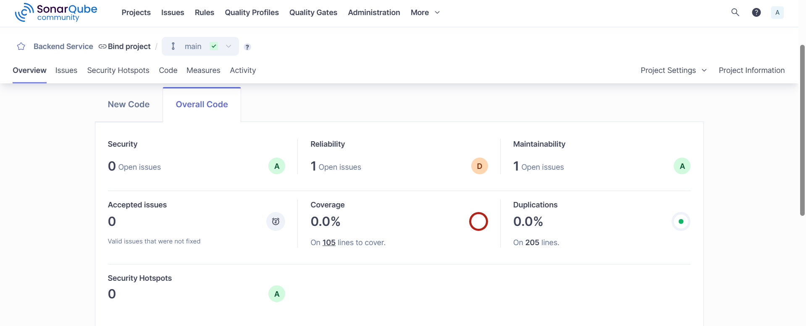  

- **Worker Project**  
  📸 This dashboard shows analysis of the worker service that handles multi-cloud metrics.  
  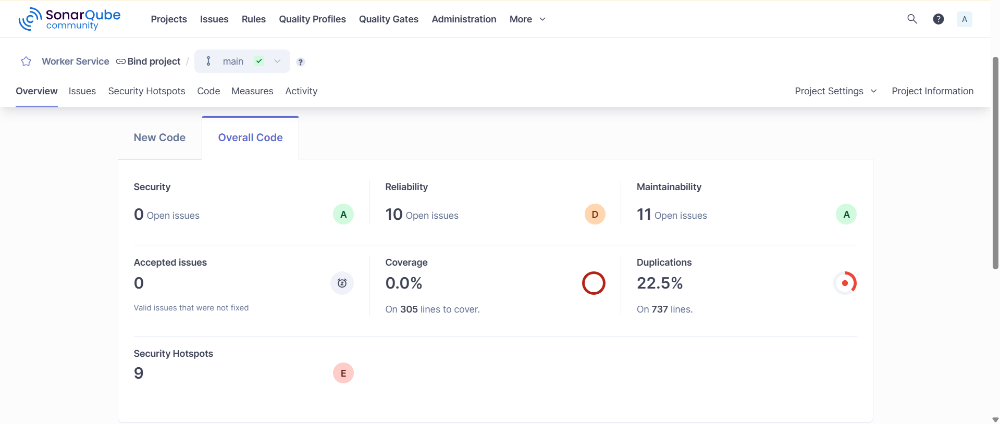  

- **Terraform Project**  
  📸 This dashboard shows analysis of Terraform IaC for infrastructure provisioning.  
  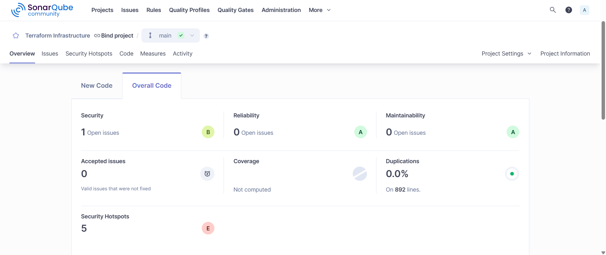  

---

### 🔹 Trivy Scan Proofs

#### App Build
Each application component undergoes **FS, Config, and Image scans**.  

- **Frontend FS Scan** → Checks ReactJS filesystem for vulnerabilities  
  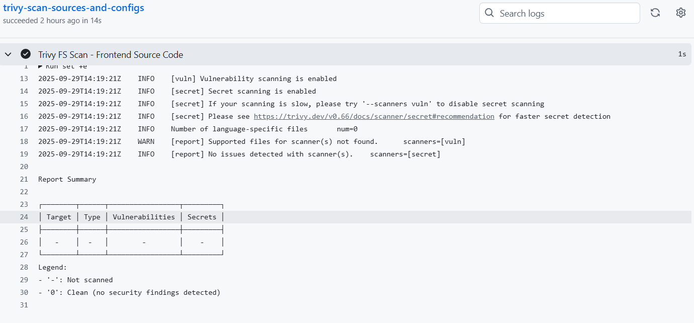  

- **Frontend Config Scan** → Validates config files for misconfigurations  
  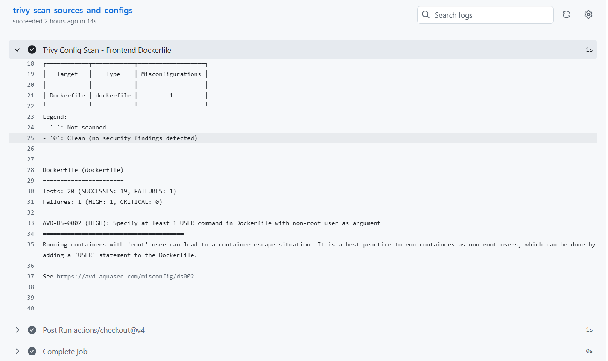  

- **Frontend Docker Image Scan** → Detects CVEs in the final image  
  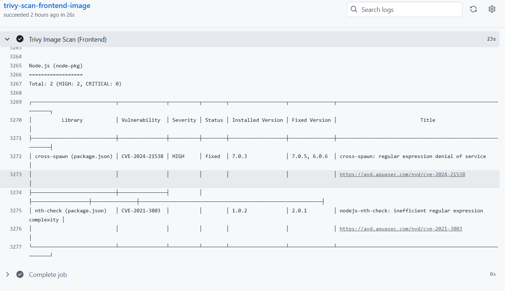  

- **Backend FS Scan**  
  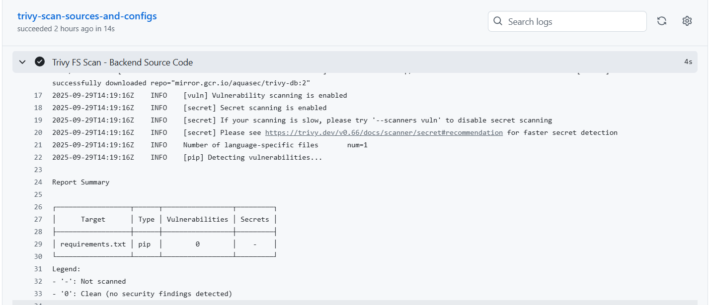  

- **Backend Config Scan**  
  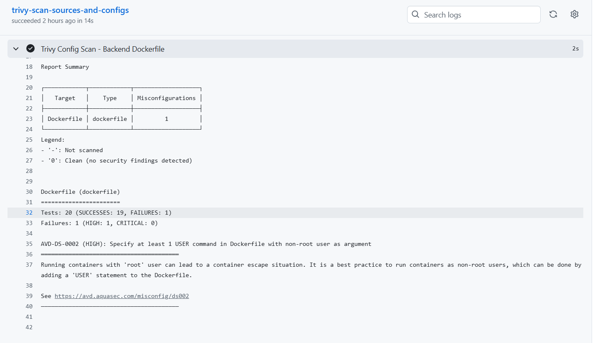  

- **Backend Docker Image Scan**  
  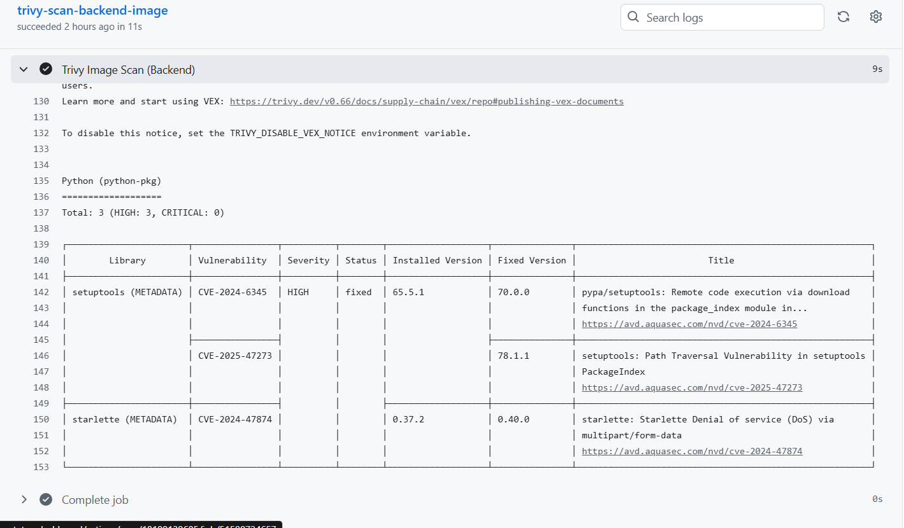  

- **Worker FS Scan**  
  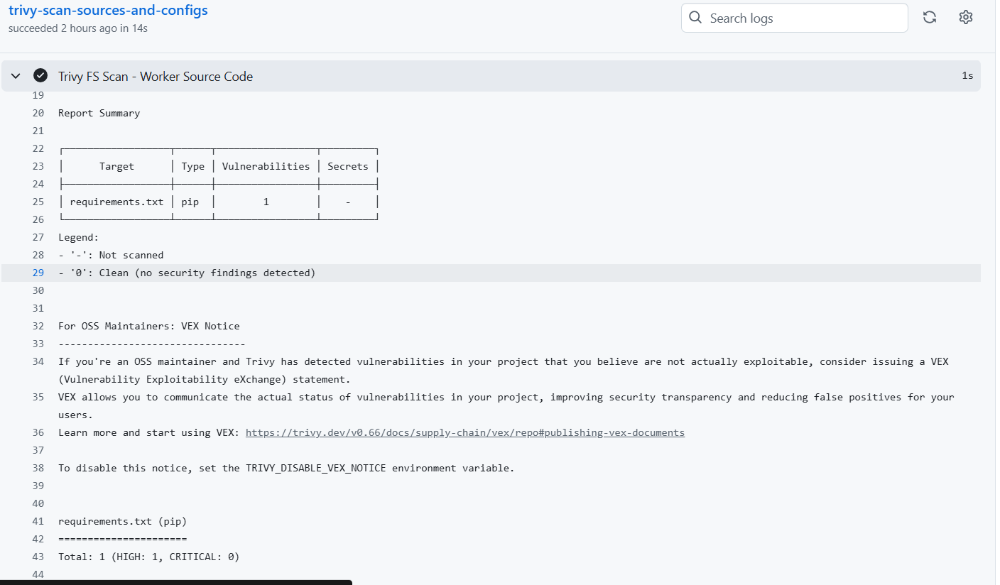  

- **Worker Config Scan**  
  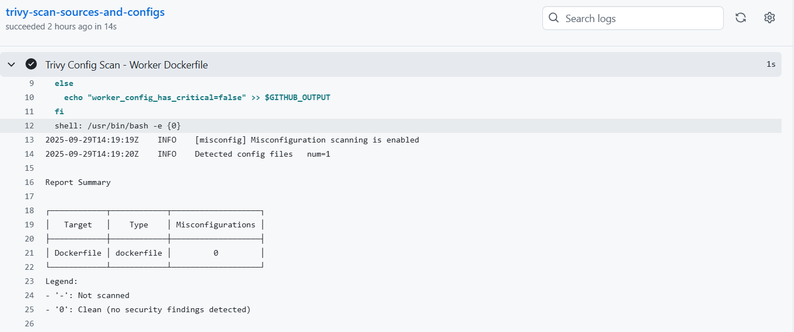  

- **Worker Docker Image Scan**  
  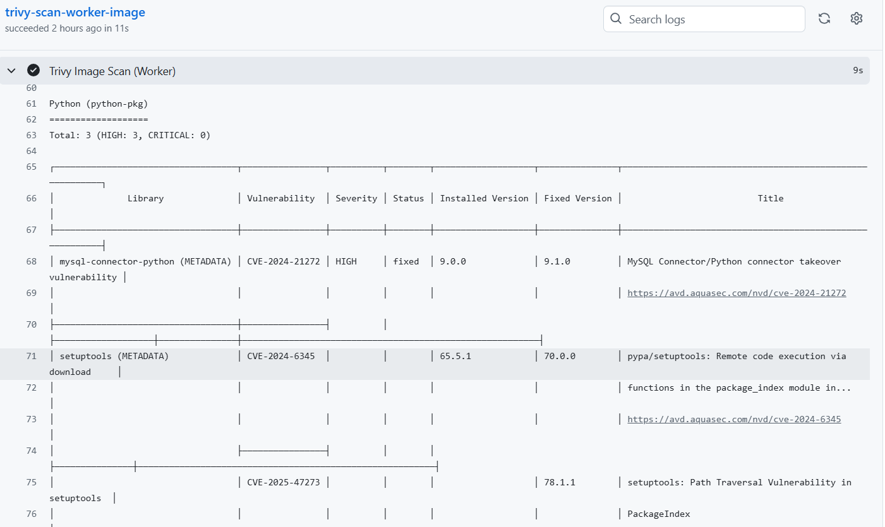  

---

#### Infra Creation
Terraform project scans before provisioning resources.  

- **FS Scan (Terraform)** → Detects issues in Terraform modules  
  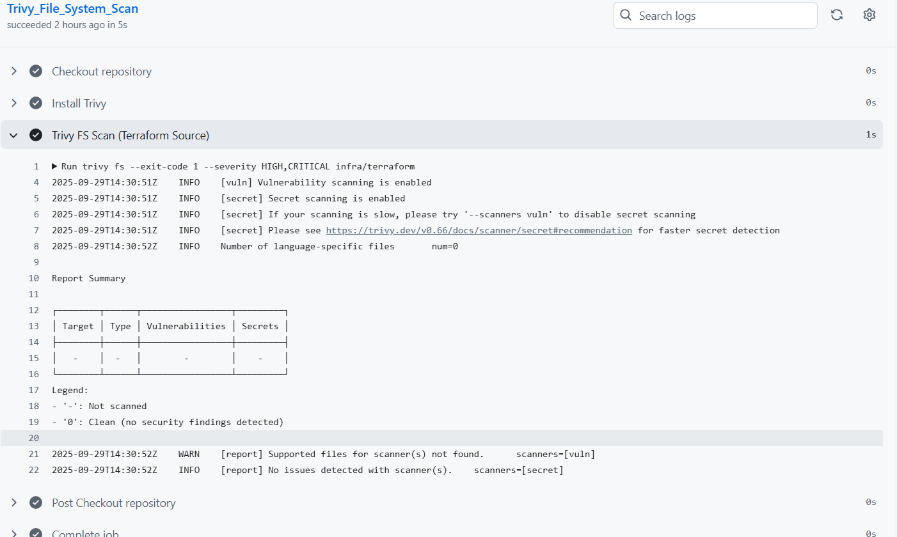  

- **Config Scan (Terraform)** → Validates IaC security posture  
  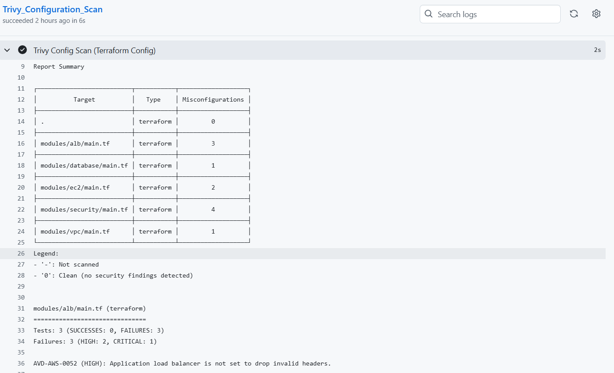  

---

## ✅ Summary
This CI/CD + DevSecOps pipeline ensures:  
- **Security and Quality Gates** at every stage  
- **Zero-downtime deployments** with Blue-Green + Rolling strategies  
- **Automated rollback** with S3 JSON configs  
- **Infrastructure compliance** with SonarQube + Trivy scans  
- **Full transparency** with screenshots proving pipeline execution and security checks  
